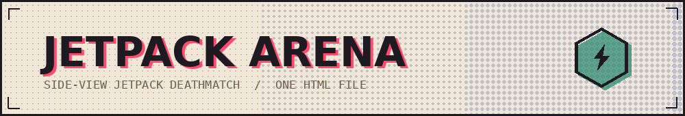

**Jetpack Arena** is a side-view jetpack deathmatch that runs in a browser tab. No install, no account, no build step: one HTML file, plain JavaScript, canvas for everything.

Live: **https://asra-iram.github.io/jetpack-arena/**

## State of the build

Local match against bots is playable end to end. Networked rooms, where two people join from separate devices with a room code, are the next piece of work and are not in this build yet.

## How it plays

First to twelve knockouts, or the highest score when three minutes run out. You respawn two seconds after going down.

Hold the jet to fly. Fuel drains while you climb and refills the moment you let go, so flying is a series of short bursts rather than a hover.

Crates drop a better gun. Hexagonal canisters carry one of five effects, three good and two bad, and the mark on the shell tells you which before you commit to picking it up.

**Keyboard** - A and D move, W or Space for the jet, mouse to aim, click to fire, Q for your skill, R to reload.
**Touch** - left thumb moves and lifts, right thumb aims and fires, skill button bottom right.

## Five pilots

| Pilot | Class | Armour | Speed | Fuel | Weapon | Skill |
| :-- | :-- | --: | --: | --: | :-- | :-- |
| HAMMER | Heavy Gunner | 140 | 0.86 | 130 | Repeater | **Barrier** - a riot panel that eats bullets for five seconds |
| DART | Recon | 82 | 1.26 | 155 | Uzi | **Slipstream** - burst dash along your aim |
| LONGSHOT | Marksman | 92 | 0.98 | 100 | Sniper | **Steady** - instant reload, then two rounds punch through cover |
| BREACH | Demolition | 108 | 0.94 | 110 | Rocket | **Kickoff** - a charge at your boots that throws you up and shoves enemies back |
| GHOST | Infiltrator | 90 | 1.12 | 120 | Shotgun | **Blink** - a short hop through the air toward your aim |

## Five canisters

Three help, two hurt. Good ones are green, bad ones are pink, and every one carries its own mark.

- **Overclock** - fire rate doubled for nine seconds
- **Ghost Shell** - half damage taken for nine seconds
- **Sky Surge** - jet fuel stops draining for nine seconds
- **Jammed Rig** - slow, wild shots for seven seconds
- **Dead Weight** - heavy legs and thirsty jets for seven seconds

## Six arenas

| Arena | Character |
| :-- | :-- |
| Neon Skyline | Rooftops above a sleeping city, an aircraft light crossing the sky |
| Monsoon Docks | Container yard in the rain, swinging crane, lightning, splashes on the ledges |
| Dune Outpost | Open sand and long sightlines, heat shimmer over the horizon |
| Orbital Deck | Low gravity, so jumps hang; a satellite drifts past |
| Latent Space | Ledges inside a thinking model, signals travelling along the network behind you |
| Ash Foundry | Tight catwalks over the melt, smoke rising from the stacks |

## Two art directions

Switch between them in the lobby. Same geometry, different press.

**Riso Poster** - flat spot inks on paper stock, every shape printed twice with the colour layer slightly out of register, halftone screen across the sky, crop marks at the corners.

**Shadow Theatre** - black silhouettes against a painted sky, depth carried by three bands of darkness, light shafts from the sun or moon, ground fog, and a single accent light on each pilot.

## Built with

Plain HTML, CSS and JavaScript. Canvas 2D for the arena and for every character and icon, all drawn in code rather than loaded as images. Web Audio for the sound, which is synthesised at run time so the page ships with no audio files. The Vibration API for haptics on phones.

Effects run at three levels - full, lite, off - which controls weather density, paper grain and screen shake, and the setting is remembered.
